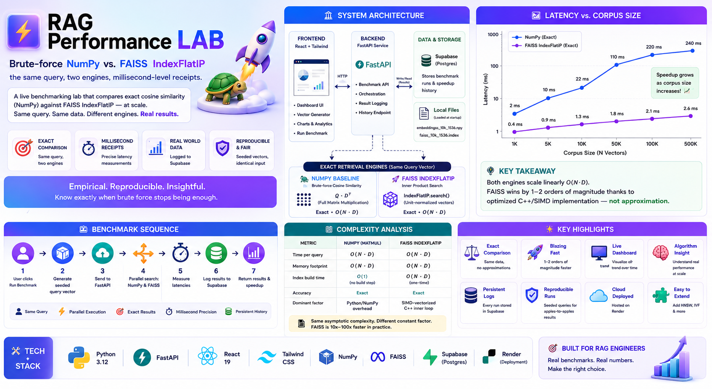
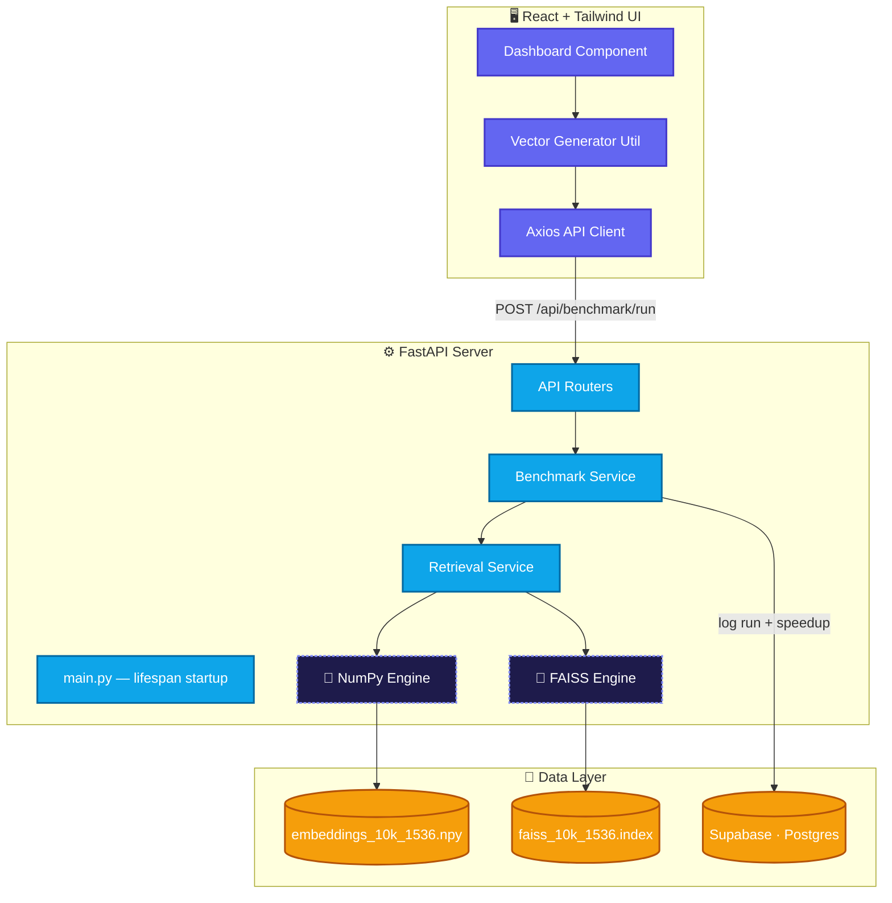
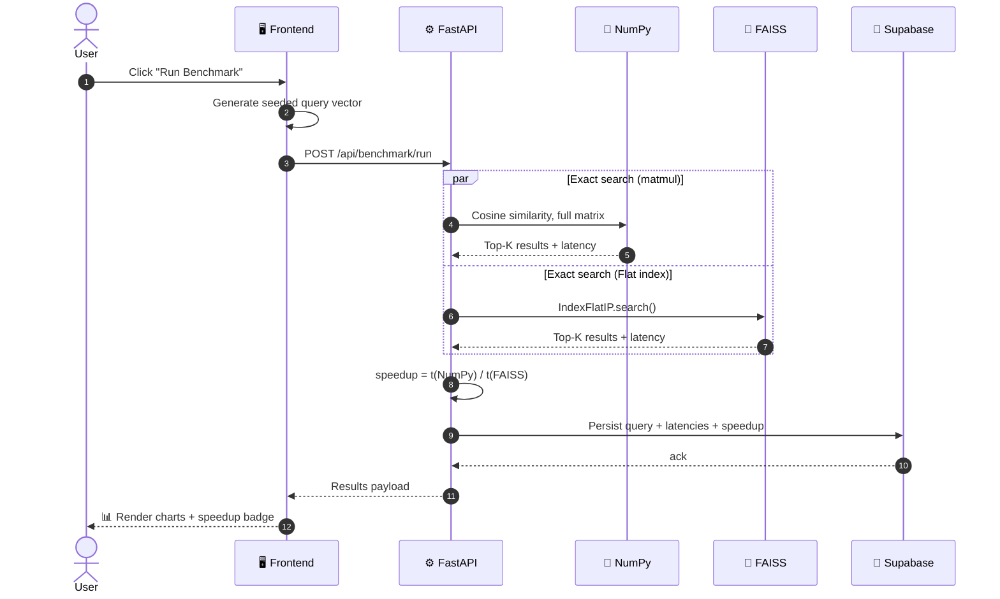
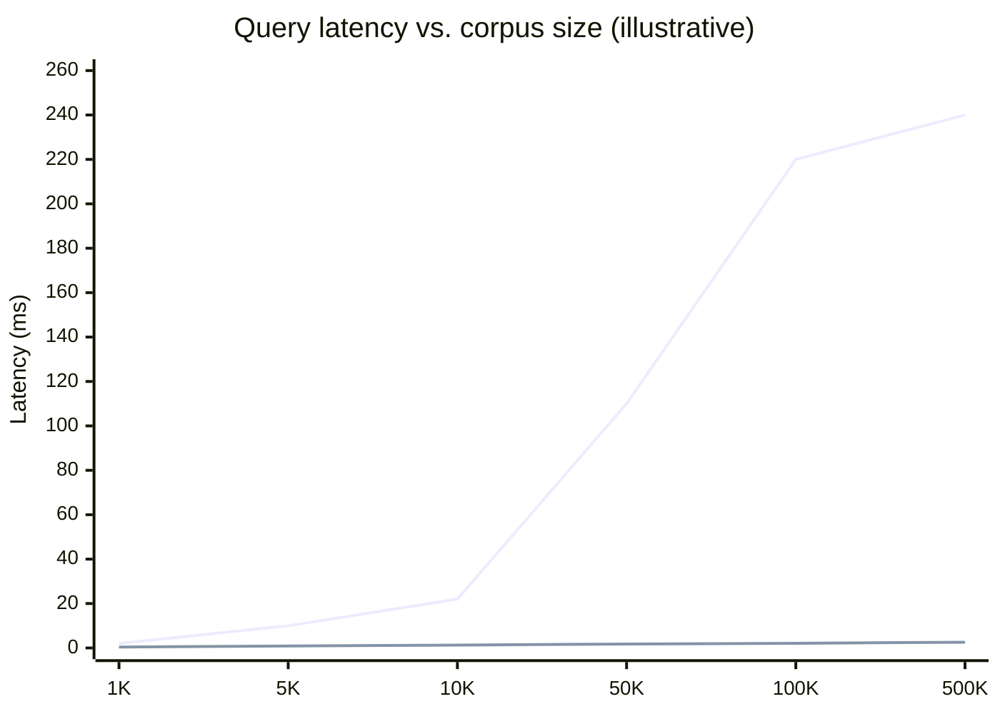
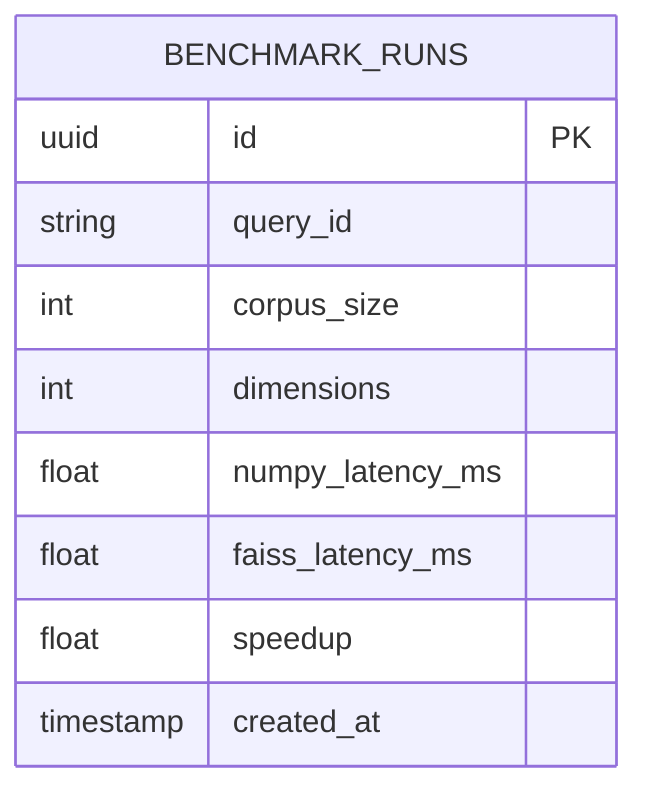
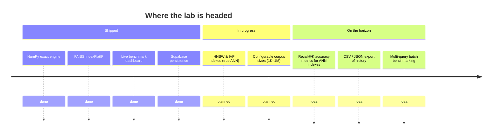

<div align="center">

# ⚡ RAG Performance LAB

### Brute-force NumPy vs. FAISS `IndexFlatIP` — the same query, two engines, millisecond-level receipts.

[](https://rag-performance-lab-fastapi-react-0gdq.onrender.com)
[](https://rag-performance-lab-fastapi-react.onrender.com)
[](https://github.com/paras160500/RAG-Performance-LAB-FastAPI-React-Tailwind)


</div>

> Every RAG engineer eventually asks: *"At what point does my brute-force cosine similarity loop stop being good enough?"*
> This lab answers it empirically — with seeded, reproducible 1536‑dimensional vectors (`text-embedding-3-small` dimensionality) — instead of by folklore.

### 🔗 Live Preview

| | Link | Notes |
|---|---|---|
| 🚀 **App (Frontend)** | [rag-performance-lab-fastapi-react-0gdq.onrender.com](https://rag-performance-lab-fastapi-react-0gdq.onrender.com) | No signup — click **"Run Benchmark"** to fire a live query |
| ⚙️ **API (Backend)** | [rag-performance-lab-fastapi-react.onrender.com](https://rag-performance-lab-fastapi-react.onrender.com) | FastAPI service the frontend talks to; `/api/health` for a quick liveness check |
| 📦 **Source Code** | [github.com/paras160500/RAG-Performance-LAB-FastAPI-React-Tailwind](https://github.com/paras160500/RAG-Performance-LAB-FastAPI-React-Tailwind) | Full backend + frontend source |

> ⏱️ Both services run on Render's free tier — the **first** request after idle may take a few seconds to wake up.


---



## 📖 Contents

- [Overview](#-overview)
- [Why FAISS is faster (and why that's not "approximation")](#-why-faiss-is-faster-and-why-thats-not-approximation)
- [System Architecture](#️-system-architecture)
- [Benchmark Sequence](#-benchmark-sequence)
- [Complexity Analysis](#-complexity-analysis)
- [Latency vs. Corpus Size](#-latency-vs-corpus-size)
- [API Reference](#-api-reference)
- [Data Model](#-data-model)
- [Tech Stack](#️-tech-stack)
- [Repository Layout](#-repository-layout)
- [Getting Started](#-getting-started)
- [Environment Variables](#-environment-variables)
- [Testing](#-testing)
- [Deployment](#️-deployment)
- [Roadmap](#️-roadmap)
- [Contributing](#-contributing)
- [License](#-license)
- [References & Credits](#-references--credits)

---

## 🔍 Overview

| | Strategy | Implementation | Accuracy guarantee |
|---|---|---|---|
| 🐢 | **NumPy baseline** | Vectorized cosine similarity via full `@` matmul against the whole embedding matrix | Exact — always correct, cost grows linearly with corpus size |
| 🚀 | **FAISS `IndexFlatIP`** | Inner-product search over unit-normalized vectors, C++/SIMD-optimized | **Also exact** — see below |

Every run fires the **same seeded query vector** at both engines back-to-back, times each to the millisecond, and logs the result (query id, corpus size, both latencies, computed speedup) to Supabase — so the reported speedup is a running empirical trend across many runs, not a single cherry-picked measurement.

---

## 🎯 Why FAISS is faster (and why that's not "approximation")

A common misconception is that FAISS wins because it trades accuracy for speed. `IndexFlatIP` doesn't — it performs a full, exhaustive scan over every vector in the index, exactly like the NumPy path. Since the vectors are unit-normalized, inner product *is* cosine similarity, so there is zero approximation error introduced by the math.

The speedup instead comes entirely from **implementation-level efficiency**:

- Tight, cache-friendly C++ loops over contiguous memory instead of Python/NumPy dispatch overhead
- BLAS-backed matrix operations with SIMD vectorization (AVX2/AVX-512 where available)
- No per-call Python interpreter overhead once the index is built

This matters for the roadmap: true *approximate* nearest neighbor (ANN) structures — HNSW, IVF — are a separate, later trade-off (recall vs. latency), not what's being measured today. Today's benchmark isolates **implementation speed at equal accuracy**, which is arguably the more interesting first question to answer before reaching for approximation.

---

## 🏗️ System Architecture

A React SPA that only speaks HTTP to a FastAPI service. Both engines are pre-loaded into memory at process startup via a `lifespan` context manager, so the first request pays no cold-start tax.



---

## 🎬 Benchmark Sequence

Both engines receive the identical seeded query vector, dispatched in parallel, so the comparison is never apples-to-oranges.



---

## 📊 Complexity Analysis

Both engines perform the *same* asymptotic work — the difference is the constant factor, not the exponent.

| Metric | NumPy (matmul) | FAISS `IndexFlatIP` |
|---|---|---|
| Time per query | O(N · D) | O(N · D) |
| Memory footprint | O(N · D) resident matrix | O(N · D) resident index |
| Index build time | O(1) — no build step | O(N · D) — one-time, amortized across queries |
| Accuracy | Exact | Exact |
| Dominant cost driver | Python/NumPy dispatch overhead | SIMD-vectorized C++ inner loop |

Where `N` = corpus size, `D` = embedding dimensionality (1536). The practical takeaway: neither engine changes the growth curve — corpus size still dominates cost — but FAISS pushes the constant factor down by roughly one to two orders of magnitude.

---

## 📈 Latency vs. Corpus Size

Illustrative shape of both curves as corpus size scales (both grow linearly; note the different slopes):



Both lines are linear in `N` as the complexity table predicts — the gap that opens up between them is the constant-factor win from FAISS's optimized inner loop, and it compounds the larger the haystack gets.

---

## 🔌 API Reference

| Method | Endpoint | Description |
|---|---|---|
| `POST` | `/api/benchmark/run` | Runs one query against both engines, persists the result, returns latencies + speedup |
| `GET` | `/api/benchmark/history` | Returns historical runs logged to Supabase, for trend charts |
| `GET` | `/api/health` | Liveness/readiness probe — confirms both engines are loaded in memory |

**Sample response — `POST /api/benchmark/run`:**

```json
{
  "query_id": "run_8f3a1c",
  "corpus_size": 10000,
  "dimensions": 1536,
  "results": {
    "numpy": { "latency_ms": 42.7, "top_k": 5 },
    "faiss": { "latency_ms": 1.3, "top_k": 5 }
  },
  "speedup": "32.8x",
  "logged_to_supabase": true
}
```

---

## 🗄️ Data Model



One row per benchmark run — enough to reconstruct the full latency/speedup history shown on the dashboard without re-running anything.

---

## 🛠️ Tech Stack

| Layer | Stack |
|---|---|
| 🎨 Frontend | React 19 · Vite · Tailwind CSS · Axios · Lucide Icons |
| ⚙️ Backend | FastAPI · Python 3.12 · Uvicorn (lifespan-managed startup) |
| 🔎 Retrieval | FAISS `IndexFlatIP` · NumPy vectorized cosine similarity |
| 💾 Persistence | Supabase (Postgres) |
| ☁️ Deployment | Render — separate web service (API) + static site (UI) |

---

## 📂 Repository Layout

```
.
├── backend
│   ├── app
│   │   ├── api            # FastAPI route definitions
│   │   ├── core           # Configuration & security
│   │   ├── db             # Supabase client integration
│   │   ├── retrieval      # FAISS & NumPy engine implementations
│   │   ├── schemas        # Pydantic models for validation
│   │   └── services       # Business logic & benchmarking
│   └── data               # Vector embeddings & FAISS indexes
├── frontend
│   ├── src
│   │   ├── components     # Reusable UI components
│   │   ├── pages          # Dashboard & view logic
│   │   ├── services       # API communication layer
│   │   └── utils          # Vector generation & math helpers
│   └── public              # Static assets
└── .gitignore
```

---

## ⚙️ Getting Started

**Backend**

```bash
cd backend
python -m venv venv
source venv/bin/activate        # Windows: venv\Scripts\activate
pip install -r requirements.txt
# add Supabase credentials to .env — see Environment Variables below
uvicorn app.main:app --reload
```

**Frontend**

```bash
cd frontend
npm install
# set VITE_API_URL in .env
npm run dev
```

> 🔑 You'll need a free [Supabase](https://supabase.com) project, plus the pre-generated `embeddings_10k_1536.npy` and `faiss_10k_1536.index` files under `backend/data`.

---

## 🔐 Environment Variables

| Variable | Location | Description |
|---|---|---|
| `SUPABASE_URL` | `backend/.env` | Supabase project URL |
| `SUPABASE_KEY` | `backend/.env` | Supabase service/anon key used for logging benchmark runs |
| `VITE_API_URL` | `frontend/.env` | Base URL the frontend uses to reach the FastAPI backend |

---

## 🧪 Testing

```bash
cd backend
pytest                # unit tests for retrieval engines + API routes
```

Keep engine-comparison tests deterministic by pinning the random seed used for query-vector generation — both engines must receive byte-identical input for the speedup number to mean anything.

---

## ☁️ Deployment

Deployed on Render as two decoupled services:

- **Web Service** (`backend/`) — FastAPI + Uvicorn, engines loaded at startup via `lifespan`
- **Static Site** (`frontend/`) — Vite production build, talks to the backend via `VITE_API_URL`

Cold starts on Render's free tier can add a few seconds to the first request after idle — the `lifespan` startup hook only avoids *engine* load time, not platform-level cold starts.

---

## 🗺️ Roadmap



---

## 🤝 Contributing

Issues and PRs are welcome. If you're adding a new index type (HNSW, IVF, etc.), please include:

1. A short note on its accuracy/latency trade-off vs. the existing exact baselines
2. A benchmark run comparing it against both `NumPy` and `IndexFlatIP` at the same corpus size

---

## 📄 License

Add a license (e.g. MIT) if you intend for others to reuse this — none is currently declared in the repository.

---

## 📝 References & Credits

1. [GitHub Repository](https://github.com/paras160500/RAG-Performance-LAB-FastAPI-React-Tailwind)
2. [FastAPI Documentation](https://fastapi.tiangolo.com/)
3. [FAISS Documentation](https://github.com/facebookresearch/faiss)
4. [Supabase Documentation](https://supabase.com/docs)

<div align="center">

---

**Built by [Paras Patel](https://github.com/paras160500)** · assisted by Manus AI

⭐ **Star the repo** if the turtle's still faster than you expected.

</div>
