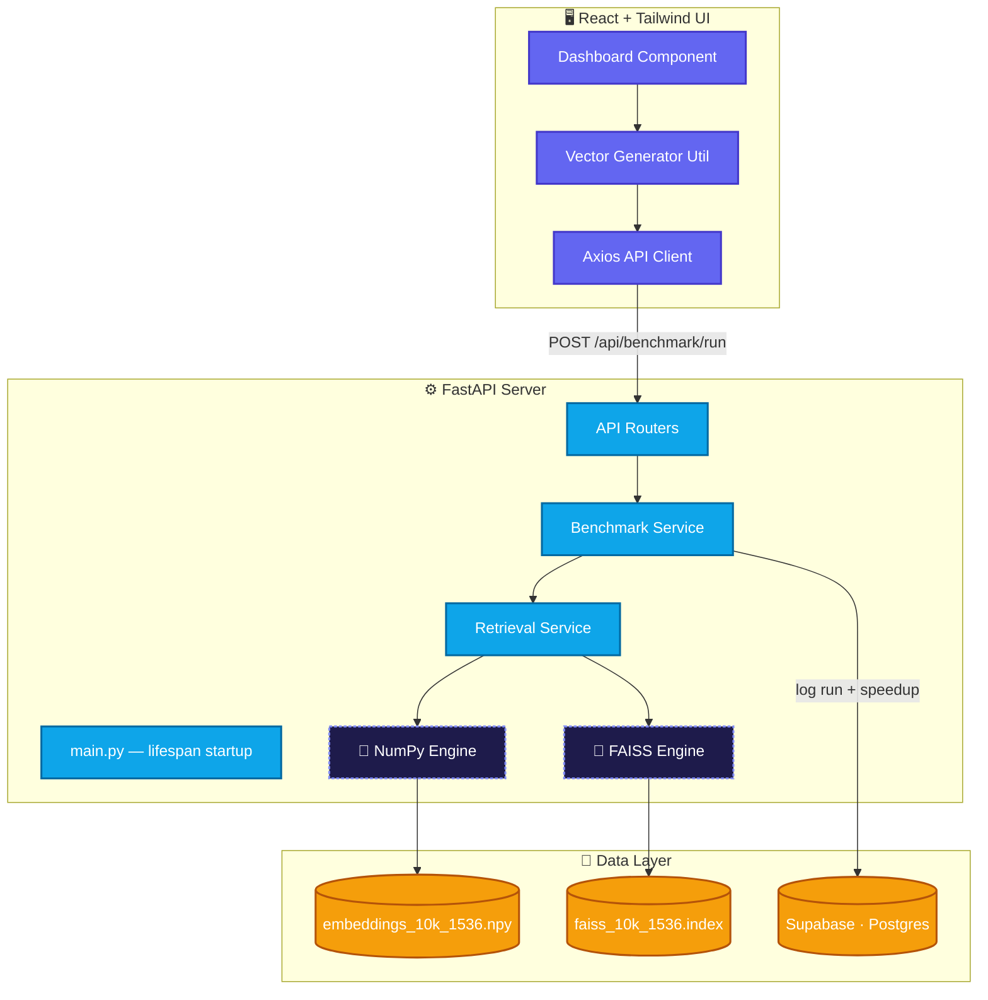
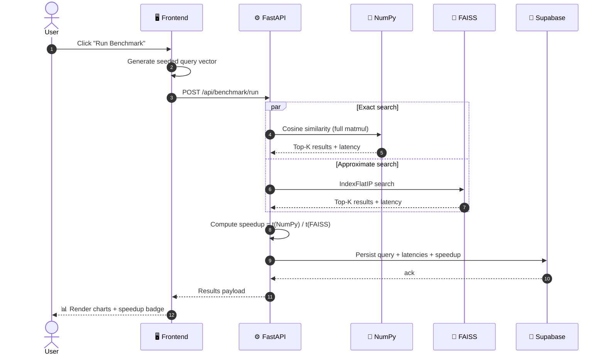
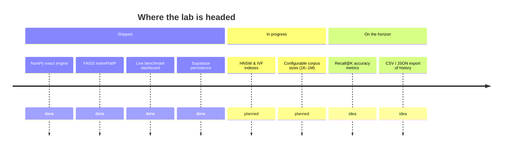

<div align="center">

# ⚡ RAG Performance LAB

### Brute-force NumPy vs. FAISS `IndexFlatIP` — the same query, two engines, millisecond-level receipts.


[](https://rag-performance-lab-fastapi-react-0gdq.onrender.com)
[](https://rag-performance-lab-fastapi-react.onrender.com)
[](https://github.com/paras160500/RAG-Performance-LAB-FastAPI-React-Tailwind)


</div>

### 🔗 Live Preview

| | Link | Notes |
|---|---|---|
| 🚀 **App (Frontend)** | [rag-performance-lab-fastapi-react-0gdq.onrender.com](https://rag-performance-lab-fastapi-react-0gdq.onrender.com) | No signup — click **"Run Benchmark"** to fire a live query |
| ⚙️ **API (Backend)** | [rag-performance-lab-fastapi-react.onrender.com](https://rag-performance-lab-fastapi-react.onrender.com) | FastAPI service the frontend talks to; `/api/health` for a quick liveness check |
| 📦 **Source Code** | [github.com/paras160500/RAG-Performance-LAB-FastAPI-React-Tailwind](https://github.com/paras160500/RAG-Performance-LAB-FastAPI-React-Tailwind) | Full backend + frontend source |

> Every RAG engineer eventually asks: *"At what point does my brute-force cosine similarity loop stop being good enough?"*
> This lab answers it empirically — with seeded, reproducible 1536‑dimensional vectors (`text-embedding-3-small` dimensionality) — instead of by folklore.

<div align="center">


</div>

---

## 📖 Contents

- [What it does](#-what-it-does)
- [The race, visualized](#-the-race-visualized)
- [Architecture](#️-architecture)
- [Benchmark sequence](#-benchmark-sequence)
- [Speed vs. accuracy trade-off](#-speed-vs-accuracy-trade-off)
- [Tech stack](#️-tech-stack)
- [Sample output](#-sample-output)
- [Repository layout](#-repository-layout)
- [Run it locally](#️-run-it-locally)
- [Roadmap](#️-roadmap)
- [References & credits](#-references--credits)

---

## 🔍 What it does

Every RAG engineer eventually asks: *"At what point does my brute-force cosine similarity loop stop being good enough?"*

This lab answers it empirically instead of by folklore. It generates reproducible, seeded **1536-dimensional embeddings** (the same dimensionality as `text-embedding-3-small`), then races two retrieval strategies against each other on identical queries:

| | Strategy | Guarantee |
|---|---|---|
| 🐢 | **NumPy** — vectorized cosine similarity (`@` matmul) against the full matrix | Exact, always correct, gets slower as the corpus grows |
| 🚀 | **FAISS** `IndexFlatIP` — inner-product search on unit-normalized vectors | Near-identical accuracy, built for scale via SIMD & optimized memory access |

Every run is logged to Supabase, so you can watch the speedup trend accumulate across sessions instead of trusting a single lucky measurement.

---

## 🏁 The race, visualized


The bigger the haystack, the more this gap matters — NumPy pays for every extra vector, FAISS barely notices.

---

## 🏗️ Architecture

Decoupled by design: a React SPA that only speaks HTTP to a FastAPI service, which pre-loads both engines into memory at startup via a lifespan context manager — no cold-start tax on the first request.



---

## 🎬 Benchmark sequence

Same seeded query vector, dispatched to both engines back-to-back, so the comparison is never apples-to-oranges.



---

## 🎯 Speed vs. accuracy trade-off

```mermaid
quadrantChart
    title Where each engine lands
    x-axis Slower --> Faster
    y-axis Approximate --> Exact
    quadrant-1 Best of both
    quadrant-2 Precise, doesn't scale
    quadrant-3 Avoid
    quadrant-4 Fast, slightly approximate
    NumPy (exact): [0.22, 0.95]
    FAISS (IndexFlatIP): [0.88, 0.9]
```

FAISS's `IndexFlatIP` is a rare case where you barely give up accuracy for a huge speed win — normalized inner product *is* cosine similarity, so there's no approximation error from the math itself, only from the search structure.

---

## 🛠️ Tech stack

| Layer | Stack |
|---|---|
| 🎨 Frontend | React 19 · Vite · Tailwind CSS · Axios · Lucide Icons |
| ⚙️ Backend | FastAPI · Python 3.12 · Uvicorn (lifespan-managed startup) |
| 🔎 Retrieval | FAISS `IndexFlatIP` · NumPy vectorized cosine similarity |
| 💾 Persistence | Supabase (Postgres) |
| ☁️ Deployment | Render — separate web service (API) + static site (UI) |

---

## 💻 Sample output

What a single benchmark run returns from the API:

```json
{
  "query_id": "run_8f3a1c",
  "corpus_size": 10000,
  "dimensions": 1536,
  "results": {
    "numpy": { "latency_ms": 42.7, "top_k": 5 },
    "faiss": { "latency_ms": 1.3, "top_k": 5 }
  },
  "speedup": "32.8x",
  "logged_to_supabase": true
}
```

---

## 📂 Repository layout

```
.
├── backend
│   ├── app
│   │   ├── api            # FastAPI route definitions
│   │   ├── core           # Configuration & security
│   │   ├── db             # Supabase client integration
│   │   ├── retrieval      # FAISS & NumPy engine implementations
│   │   ├── schemas        # Pydantic models for validation
│   │   └── services       # Business logic & benchmarking
│   └── data               # Vector embeddings & FAISS indexes
├── frontend
│   ├── src
│   │   ├── components     # Reusable UI components
│   │   ├── pages          # Dashboard & view logic
│   │   ├── services       # API communication layer
│   │   └── utils          # Vector generation & math helpers
│   └── public             # Static assets
└── .gitignore
```

---

## ⚙️ Run it locally

**Backend**
```bash
cd backend
python -m venv venv
source venv/bin/activate        # Windows: venv\Scripts\activate
pip install -r requirements.txt
# add Supabase credentials to .env
uvicorn app.main:app --reload
```

**Frontend**
```bash
cd frontend
npm install
# set VITE_API_URL in .env
npm run dev
```

> 🔑 You'll need a free [Supabase](https://supabase.com) project, plus the pre-generated `embeddings_10k_1536.npy` and `faiss_10k_1536.index` files under `backend/data`.

---

## 🗺️ Roadmap



---

## 📝 References & credits

1. [GitHub Repository](https://github.com/paras160500/RAG-Performance-LAB-FastAPI-React-Tailwind)
2. [FastAPI Documentation](https://fastapi.tiangolo.com/)
3. [FAISS Documentation](https://github.com/facebookresearch/faiss)
4. [Supabase Documentation](https://supabase.com/docs)

<div align="center">

---

**Built by [Paras Patel](https://github.com/paras160500)** · assisted by Manus AI

⭐ **Star the repo** if the turtle made you smile.

</div>
